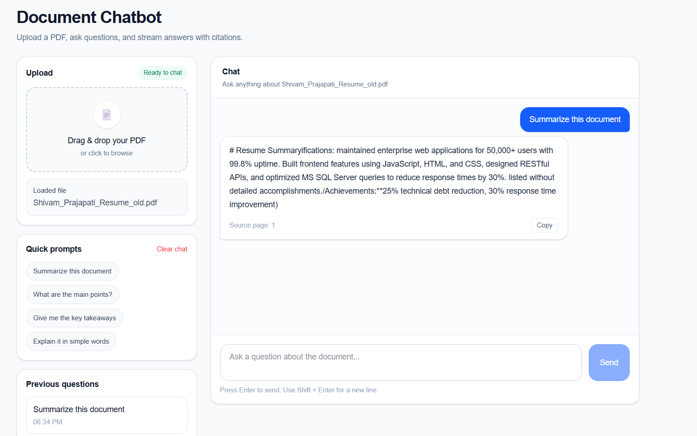

# Document Chatbot


Upload any PDF and chat with it. Answers stream word by word, memory keeps the conversation context, and every answer shows which page it came from.

---

## Features

- **Upload any PDF** — drag and drop any document into the browser
- **Streaming answers** — responses appear word by word, like ChatGPT
- **Page citations** — every answer shows which page the information came from
- **Conversation memory** — follow-up questions and pronouns work correctly
- **Persistent vector store** — ChromaDB saves embeddings to disk so re-uploads are instant

---

## Screenshot



---

## How it works

```
User uploads PDF
      ↓
Backend splits into chunks → embeds with sentence-transformers → stores in ChromaDB
      ↓
User asks a question
      ↓
ChromaDB finds the 3 most relevant chunks (semantic search)
      ↓
Claude answers from those chunks via streaming SSE
      ↓
Answer streams to browser word by word + page citations at the end
```

---

## Demo

```
[Upload: Shivam_Prajapati_Resume.pdf]  ✓ Ready

You:  What is the most recent job?
Bot:  The most recent role is Software Developer Intern at Find Me LLC,
      from August to November 2025.
      [Source: page 1]

You:  How long was he there?
Bot:  About 4 months, from August to November 2025.
      [Source: page 1]

You:  What AI skills are listed?
Bot:  The resume lists LLM Integration, Prompt Engineering, RAG Pipelines,
      LangChain, ChromaDB, Vector Databases, OpenAI API, Claude API,
      Gemini API, and scikit-learn.
      [Source: page 1]
```

---

## What I learned building this

- How to build a **streaming FastAPI endpoint** using Server-Sent Events (SSE)
- How to handle **LangChain v1.2.x breaking changes** — `langchain.memory` and `langchain.chains` were removed; replaced with `ChatMessageHistory` and `langchain_classic`
- Why **streaming uses the raw Anthropic SDK** directly instead of LangChain — more reliable and version-safe
- How to **pass conversation history as tuples** to `ConversationalRetrievalChain` manually
- How to connect a **Next.js EventSource** to a FastAPI SSE stream
- How to deploy a **full-stack AI app** on Railway (backend) + Vercel (frontend)

---

## Project structure

```
doc-chatbot/
├── backend/
│   ├── main.py              ← FastAPI server: /upload, /chat, /stream
│   ├── rag.py               ← LangChain RAG logic + memory + streaming
│   ├── requirements.txt
│   └── .env.example
├── frontend/
│   ├── app/
│   │   └── page.tsx         ← full UI: upload, chat, streaming display
│   ├── next.config.js       ← proxy /api/* → backend
│   ├── package.json
│   └── tsconfig.json
├── .gitignore
└── README.md
```

---

## Setup and run locally

### Prerequisites

- Python 3.11+
- Node.js 18+
- Anthropic API key

### Backend

```bash
cd backend

pip install -r requirements.txt

cp .env.example .env
# Add your ANTHROPIC_API_KEY to .env

uvicorn main:app --reload --port 8000
```

### Frontend

```bash
cd frontend

npm install

npm run dev
```

Open [http://localhost:3000](http://localhost:3000).

---

## How to use

1. Click **Browse** and select any PDF file
2. Wait for the **Ready** status (takes 10–30 seconds for first upload)
3. Type a question and press **Enter** or click **Ask**
4. Watch the answer stream in live
5. See the page citation below the answer
6. Ask follow-up questions — the bot remembers the conversation
7. Upload a new PDF to start fresh

---

## Tech stack

| Layer | Technology |
|-------|-----------|
| AI | Anthropic Claude Haiku |
| RAG | LangChain 1.2.x, ChromaDB, sentence-transformers |
| Backend | Python, FastAPI, uvicorn |
| Streaming | Server-Sent Events (SSE) via raw Anthropic SDK |
| Frontend | Next.js 14, TypeScript, Tailwind CSS |
| Deployment | Vercel (frontend), Railway (backend) |

---

## API endpoints

| Method | Endpoint | Description |
|--------|----------|-------------|
| POST | `/upload` | Upload a PDF — embeds and stores in ChromaDB |
| GET | `/chat?question=...` | Ask a question — returns JSON answer + pages |
| GET | `/stream?question=...` | Ask a question — streams answer as SSE tokens |
| GET | `/` | Health check |

---

## Known limitations

- Only one PDF can be loaded at a time — uploading a new PDF wipes the previous one
- Memory resets if the backend server restarts (Railway sleeps after 15 mins of inactivity)
- Works best with text-based PDFs — scanned image PDFs may extract poorly
